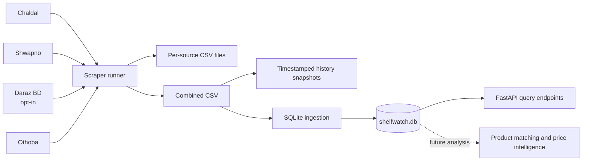

# ShelfWatch

**Price and shelf-availability intelligence for Bangladesh grocery retail.**

ShelfWatch collects publicly visible product listings from selected Bangladeshi
retail websites, keeps timestamped snapshots, and stores them locally for later
comparison and analysis. The project is currently focused on building a
reliable data-collection foundation; cross-retailer product matching, price
analytics, and production-ready predictive features remain future work. A
baseline stock-out model is available for offline evaluation as the data
history grows.


## At a glance

| Area | Current state |
|---|---|
| Product collection | Scrapers are present for Chaldal, Shwapno, Daraz BD, and Othoba |
| Default enabled sources | Chaldal, Shwapno, and Othoba; Daraz is opt-in |
| Latest local data observed | 648 rows: 349 Chaldal and 299 Shwapno, from October 6, 2026 |
| Snapshot history | Timestamped CSV snapshots; configured to retain up to 60 |
| Storage | Local SQLite database with content-hash ingestion deduplication |
| Analysis | A basic data-audit script and a standalone pack-size parser are present |
| Modeling | A regularized logistic-regression stock-out baseline with temporal cross-validation |
| Automated tests | Stdlib smoke tests, passing (re-aligned to the parser API on October 7, 2026) |
| API layer | FastAPI endpoints for stock-out and shrinkflation queries (`src/api/main.py`) |
| Dashboards / production predictions | Not implemented yet |

The row counts above describe the local, ignored output files available when
this README was updated. They are a progress checkpoint, not a promise about
future scrape sizes, and the data files are not included in Git.

## Project goals

### Near-term goals

- Collect useful, timestamped product, price, and stock observations from
  public grocery listings.
- Keep the scraping and storage steps repeatable, with bounded snapshot
  history and safe repeated ingestion.
- Improve data quality enough to compare products and prices across retailers.

### Longer-term direction

- Match equivalent products across retailers, including differences in
  spelling, language, and pack size.
- Calculate comparable unit prices (for example, BDT per 100 g or 100 ml).
- Analyze price changes, discounts, and availability over time.
- Build evidence-based alerts or forecasting tools once data coverage and
  quality are sufficient.

These longer-term items are goals, not features currently delivered by the
repository.

## How the pipeline works



The optional scheduler runs the scrape and database-ingestion steps
sequentially. It starts a cycle immediately and then sleeps for six hours before
the next cycle.

## Data sources and collection methods

| Source | Collection approach | Current status |
|---|---|---|
| [Chaldal](https://chaldal.com) | HTTP requests and BeautifulSoup; prefers embedded product data and falls back to page parsing | Enabled by default |
| [Shwapno](https://www.shwapno.com) | Playwright for client-rendered listings, with an HTTP fallback | Enabled by default |
| [Daraz Bangladesh](https://www.daraz.com.bd) | HTTP and page-data parsing | Disabled by default because category listings are bot-check blocked and reachable catalog data can include irrelevant products; can be forced for an individual run |
| [Othoba](https://www.othoba.com) | HTTP requests and BeautifulSoup for server-rendered pages | Enabled by default |

The configured category paths are maintained in [`scraper/config.py`](scraper/config.py).
Scraper-specific notes and limitations are in [`scraper/README.md`](scraper/README.md).

## Collected fields

The combined dataset currently contains these columns:

| Field | Meaning |
|---|---|
| `source` | Retailer identifier |
| `title` | Product title as collected from the listing |
| `price` | Observed selling price, in BDT where available |
| `list_price` | Original/list price where available |
| `discount_percent` | Discount percentage where available |
| `stock_flag` | Collected or inferred availability (`in_stock`, `out_of_stock`, or `unknown`) |
| `category_path` | Category or breadcrumb text |
| `category_rank` | Position in the listing when available |
| `url` | Product or listing URL |
| `scraped_at` | UTC timestamp associated with the observation |

Not every source provides every field consistently. Stock status is inferred
from visible listing content and is not a guarantee of live inventory.

## Getting started

### Requirements

- Python 3.12 is the version used for the current local development snapshot.
- Internet access to the target sites is needed to scrape live data.
- Playwright's Chromium browser is optional but recommended for fuller Shwapno
  results.

### Install dependencies

Run these commands from the repository root.

**Windows PowerShell**

```powershell
python -m venv .venv
.\.venv\Scripts\Activate.ps1
python -m pip install --upgrade pip
python -m pip install -r scraper\requirements.txt
```

To enable the Playwright browser used by Shwapno:

```powershell
python -m playwright install chromium
```

**macOS / Linux**

```bash
python3 -m venv .venv
source .venv/bin/activate
python -m pip install --upgrade pip
python -m pip install -r scraper/requirements.txt
python -m playwright install chromium  # optional, for Shwapno
```

## Running ShelfWatch

Run the full default collection from the repository root:

```bash
python scraper/main.py
```

Run only selected sources:

```bash
python scraper/main.py chaldal
python scraper/main.py shwapno
python scraper/main.py othoba
```

Daraz is disabled for normal full runs. To explicitly try it:

```bash
python scraper/main.py daraz
```

Ingest the latest combined CSV into SQLite:

```bash
python src/storage/db.py
```

Run the basic dataset audit:

```bash
python src/eda/audit_snapshot.py
```

Start the six-hour scrape-and-ingest scheduler:

```bash
python run_crawler_scheduler.py
```

The scheduler is a long-running foreground process. Stop it with `Ctrl+C`.
It uses a lock file to prevent a second scheduler from running at the same
time.

## Outputs and storage

Generated data is kept locally under `scraper/output/`:

| Path | Contents |
|---|---|
| `scraper/output/chaldal_products.csv` | Latest Chaldal results |
| `scraper/output/shwapno_products.csv` | Latest Shwapno results |
| `scraper/output/daraz_products.csv` | Daraz results when that scraper runs |
| `scraper/output/othoba_products.csv` | Latest Othoba results |
| `scraper/output/all_products_combined.csv` | Combined latest results |
| `scraper/output/history/snapshot_<UTC timestamp>.csv` | Timestamped historical snapshots |
| `shelfwatch.db` | Local SQLite database |

The database currently stores product observations in `snapshots` and tracks
ingested file fingerprints in `ingest_log`. A CSV is skipped if its SHA-256
content hash has already been ingested; changing the file contents creates a
new ingest run. The CSV's `scraped_at` value is retained when present.

Data files, the database, and the scheduler lock are ignored by Git. Keep a
separate backup if the local history is important.

## Current progress and known limitations

### Implemented

- Four source-specific scrapers, using server-rendered HTML where possible and
  Playwright for Shwapno's client-rendered pages.
- Category configuration, request timeouts/retries, and a three-second
  configured crawl delay.
- Combined CSV output with a UTC scrape timestamp and a rolling snapshot
  history (60 snapshots by default).
- SQLite snapshot storage with content-hash-based duplicate-ingestion
  protection.
- A six-hour scheduler with a lock file and UTF-8 child-process settings.
- A basic audit script and a standalone pack-size / normalized-price utility.
- A regularized logistic-regression stock-out baseline evaluated with
  time-ordered folds; it guards against insufficient or single-class labels.

### Known limitations and validation note

- Shwapno's HTTP fallback may return less data than Playwright.
- Daraz category grids are blocked by bot checks; Daraz remains disabled by
  default.
- Site markup and selectors can change, and collected stock flags may not
  represent real-time inventory.
- Product matching across retailers and pack-size normalization are not yet
  integrated into the collection/storage pipeline.
- The stock-out baseline is an offline evaluation, not a deployed predictor.
  It needs at least 1,000 snapshot rows and 20 positive `out_of_stock` labels;
  single-class training folds are skipped, while single-class test folds are
  fitted but excluded from metrics.
- The smoke-test suite was re-aligned to the current parser API
  (`parse_pack_size` / `calculate_normalized_price`) on October 7, 2026 and is
  green again; keep it passing as a validation gate before merging branches.

## Baseline stock-out model

The baseline reads timestamped observations from `shelfwatch.db` and evaluates
a regularized logistic-regression model using three time-ordered folds. It
reports PR-AUC and F2 per evaluable fold; F2 gives more weight to recall so
missed stock-outs are penalized. It does not save or deploy a trained model.

Run it against the local database from the repository root:

```bash
python src/models/train_baseline.py
```

The trainer requires at least 1,000 rows and 20 positive labels. Its current
`target_stockout` label is 1 only when a snapshot's `stock_flag` is
`out_of_stock`; all other flags are treated as 0. Keep the six-hour scheduler
running so snapshots accumulate. The trainer exits with guidance when the
minimum data is not available. Folds with single-class training windows are
skipped; models are still fitted for single-class test windows, but those
windows are excluded from metrics.

The SQL views in
[`src/features/label_definitions.sql`](src/features/label_definitions.sql)
describe repeated `out_of_stock` observations, but they are not currently used
by the baseline, which builds its target directly from `snapshots.stock_flag`.
Disappearance-based labels are not currently implemented in the training
path.

To validate the training pipeline without database data or retailer requests:

```bash
python src/models/train_baseline.py --selftest
```

The deterministic synthetic fixture is a pipeline check only; its metrics do
not estimate real-world model performance. Real evaluation becomes meaningful
only after the database has enough correctly labeled stock-out observations.

## Roadmap

The sequence below is a working direction, not a fixed delivery schedule.

| Priority | Planned update | Why it matters |
|---|---|---|
| 1 | Add fixtures for scraper outputs (smoke-test baseline restored Oct 7, 2026) | Catch data-contract regressions without depending on live sites |
| 2 | Standardize source output schemas and validate required fields | Make combined data more dependable |
| 3 | Connect pack-size parsing and normalized unit prices to stored observations | Enable fair price comparisons between different pack sizes |
| 4 | Add product identity and cross-retailer matching | Compare like-for-like products rather than raw titles |
| 5 | Expand data-quality checks and historical trend summaries | Establish reliable signals before modeling |
| 6 | Explore price/availability alerts and forecasting | Deliver consumer-facing intelligence when coverage supports it |
| 7 | Add operational monitoring and automated project checks | Make scheduled collection easier to maintain |

## Tests

Run the smoke tests from the repository root:

```bash
python -m unittest discover -s tests -v
```

`python src/models/train_baseline.py --selftest` exercises the modelling
pipeline end-to-end on a deterministic synthetic fixture (no retailer
contact, no database needed). When the stored snapshots contain too few
stock-out events the trainer exits gracefully with guidance instead of
raising a single-class error.

Tests that contact retailer websites are not required for this command.

## API

A FastAPI application in `src/api/main.py` serves a local market dashboard and
read-only query endpoints over the SQLite database. Start ShelfWatch from the
repository root:

```bash
uvicorn src.api.main:app --reload
```

Open `http://127.0.0.1:8000` for the dashboard, or
`http://127.0.0.1:8000/docs` for the interactive API reference.

| Endpoint | Description |
|---|---|
| `GET /` | ShelfWatch dashboard |
| `GET /api/health` | API and stored observation count |
| `GET /api/overview` | Current product, stock, retailer, and collection-activity summary |
| `GET /api/products` | Latest listings; supports search, retailer, stock, sort, and pagination filters |
| `GET /api/products/{snapshot_id}/history` | Price and availability history for a product |
| `GET /api/stockouts/current` | Latest products explicitly marked `out_of_stock` |
| `GET /api/shrinkflation/alerts` | Products with a smaller comparable pack-size observation |

The dashboard uses the latest stored snapshot and does not start scraping
retailer sites. Availability and prices are observations, not guarantees of
live store inventory. Pack-size alerts use stored normalized features when
available and parse product titles for older or core-only databases.

## Project documentation

Two living documents accompany this README and are updated alongside code
changes:

- [`docs/PROJECT_DOCUMENTATION.md`](docs/PROJECT_DOCUMENTATION.md) — technical
  reference: architecture, data model, pipeline semantics, commands,
  conventions, changelog, and open issues.
- [`docs/CASE_STUDY.md`](docs/CASE_STUDY.md) — dated narrative of the problems
  faced during development and the lessons learned, with a template for
  recording future entries.

## Responsible collection

ShelfWatch is intended to collect public product-listing information only.
Respect each site's current terms, robots directives, rate limits, and
applicable law before running or extending a scraper. The project configures a
three-second delay between requests; do not remove or reduce it without
reviewing the impact. Foodpanda is excluded from the configured sources.

## Repository map

```text
scraper/                 Retailer scrapers, configuration, and scraper guide
src/features/            Pack-size parsing utilities
src/storage/             SQLite schema and CSV ingestion
src/eda/                 Basic data-audit script
src/models/              Stock-out baseline model and feature builder
src/api/                 FastAPI API and same-origin market dashboard
src/api/static/          Dashboard markup, styles, and browser interactions
tests/                   Stdlib smoke tests
docs/                    Development workflow notes
run_crawler_scheduler.py Six-hour scrape-and-ingest scheduler
```

## Contributing

Changes to scrapers should preserve the common output fields, polite request
behavior, and UTF-8 handling. Run the tests and inspect the resulting diff
before submitting changes. The repository's branch and commit conventions are
documented in [`docs/GIT_WORKFLOW.md`](docs/GIT_WORKFLOW.md).

## License

No license is currently declared in this repository. Contact the project
maintainer before redistributing or reusing the code.
